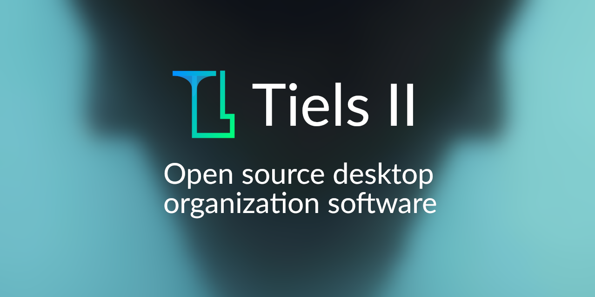

<div align="center">
    
</div>

<h1 align="center">
Tiels II
</h1>

<div align="center">
  <a href="https://github.com/DcZipPL/TielsTwo/blob/master/LICENSE">
     
  </a>

Complete Rewrite of Tiels: An alternative for Fences.
With Tiels you can organize your desktop icons with tiles.

This rewrite focuses in Stability and making this program cross-platform.
</div>

## Building instructions
### Pre-requirements
Operating System:
- Linux 4.x.x+ or Windows 10+
- other systems ware not tested!

Installed tooling:
- dotnet
- cargo
- rustc
- fontforge
- python >= 3.11 or > 3.8 with [toml package](https://pypi.org/project/toml/)

### Building
#### Build script (Requires Python)
Linux / Windows:
```shell
git clone git@github.com:DcZipPL/TielsTwo.git
./build.py
# The python script is easiest way to do it. But on windows... I will find better way!
```
All compiled binaries should be in `out` directory.
#### Manual (Python not required)
Linux / Windows:
1. Install required tooling
2. Build Tiels Launcher with `cargo build --release`
3. Downloads fonts that are included in `build/include.toml` from [lucide.dev](https://lucide.dev/)
4. Create fronts using fontforge with
   - `assets` folder SVGs
   - Downloaded [lucide.dev](https://lucide.dev/) icons SVGs
5. Copy output font (ttf) file to `Avalonia.Tiels/Assets/lucidelite.ttf`
6. Compile Tiels.Avalonia with `dotnet build`
7. Put Tiels Launcher to Tiels.Avalonia output directory
8. Launch Tiels(.exe)


## Q&A
Q: What about old Tiels repository?
- A: Tiels I repository will be archived when this project will be stable.

Q: Will I keep my files after update?
- A: Yes. You will ONLY lose all theming of your tiles. There is plan for conversion tool, but I don't promise.

Q: When version 1.0.0 / When stable... ETA?
- A: Project is work in progress there is no ETA. But you can track progress [here (GitHub Projects)](https://github.com/users/DcZipPL/projects/1).
